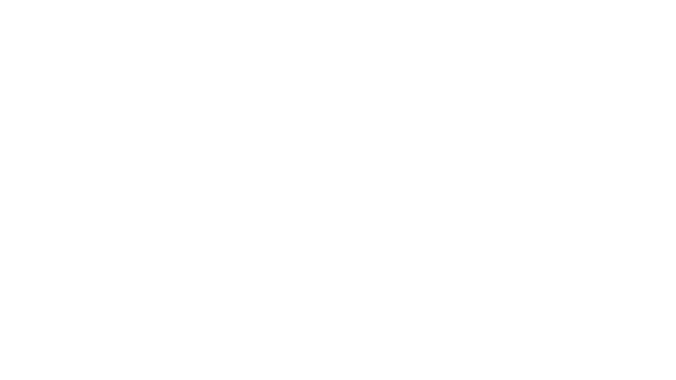
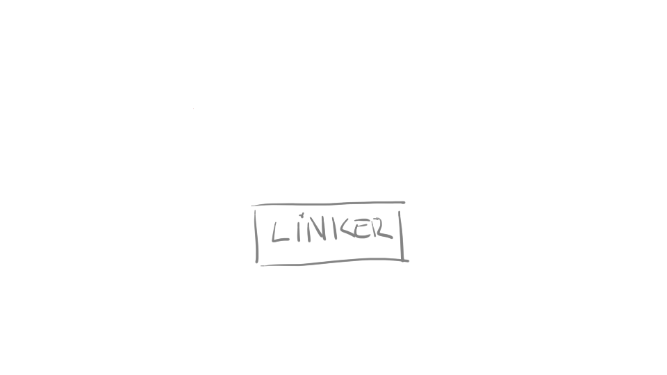

# Session 1
## Today

> - Interpreted / Compiled
> - Write a simple program 
> - Compile it !

# Interpreted vs Compiled
## Python
### Interpreted scripting language

- The executable is python, not your script
- python decodes your script at runtime

```{.bash}
python myscript.py
```
<div class="r-stack">

{.fragment}

```{.python .number-lines data-line-numbers="|1|2|3|4|3|4" .fragment}
print "hello"
print "world"
for i in range(2):
    print i
```

</div>

## C++
### The code needs to be compiled
```{.cpp}
int main() {
    std::cout << "Hello world" << std::endl;
    return 0;
}
```




### To machine code

Which the processor understands

```
0004320 0018 0000 0000 0000 0009 0000 0003 0000
0004330 0000 0000 0000 0000 0000 0000 0000 0000
0004340 3748 0000 0000 0000 0381 0000 0000 0000
0004350 0000 0000 0000 0000 0001 0000 0000 0000
0004360 0000 0000 0000 0000 0011 0000 0003 0000
0004370 0000 0000 0000 0000 0000 0000 0000 0000
0004380 3ac9 0000 0000 0000 011a 0000 0000 0000
0004390 0000 0000 0000 0000 0001 0000 0000 0000
```

In an executable file

### Role of the compiler

- Converts your code to
    - executable (.exe, ...)
    - library (.lib, .so, .dll, ...)

### Which compiler ?

- Multiple compilers available
    - gnu
        - g++ for C++
        - gcc for C
    - clang 
    - msvc (windows)
    - icc 

### Let's compile !
- Write the following code in a __main.cpp__ file with a text editor:

```{.cpp}
#include <iostream>
int main() {
    std::cout << "Hello world" << std::endl;
    return 0;
}
```

- Compile your program. It will create a.out

```{.bash}
g++ main.cpp
```

- Run a.out 

```{.bash}
./a.out
```

# Anatomy of a C++ program
## Hello world
```{.cpp}
#include <iostream>

int main(int argc, const char **argv)
{
    std::cout << "Hello world" << std::endl;
    return 0;
}
```

### \#Include

```{.cpp data-line-numbers="1" }
#include <iostream>

int main(int argc, const char **argv)
{
    std::cout << "Hello world" << std::endl;
    return 0;
}
```
> - think __import__ in python, then forget
> - it's a __preprocessor directive__ (starts with #)
> - tells the __preprocessor__ to include the file iostream

. . .

```{.bash}
g++ -E main.cpp
```

### main function

```{.cpp data-line-numbers="3" }
#include <iostream>

int main(int argc, const char **argv)
{
    std::cout << "Hello world" << std::endl;
    return 0;
}
```
> - an executable __must__ have a main function 
> - function declaration 
>    - starts with the return type (int)
>    - then the name of the function
>    - arguments in parenthesis

### function body

```{.cpp data-line-numbers="4-7" }
#include <iostream>

int main(int argc, const char **argv)
{
    std::cout << "Hello world" << std::endl;
    return 0;
}
```

- list of statements ending with semicolon
- inside curly braces


### Let's create a function !


<div class="r-stack">

```{.cpp .fragment .fade-out}
#include <iostream>

int main(int argc, const char **argv) {
    printHelloWorld();
    return 0;
}

void printHelloWorld() {
    std::cout << "Hello world" << std::endl;
}
```

```{.cpp .fragment .fade-in}
#include <iostream>

void printHelloWorld() {
    std::cout << "Hello world" << std::endl;
}

int main(int argc, const char **argv) {
    printHelloWorld();
    return 0;
}
```

</div>

```{.bash}
g++ main.cpp -o helloworld
```

> - The function declaration should precede its call.

### Remove the body

Leave only the __declaration__

```{.cpp}
#include <iostream>

void printHelloWorld();

int main(int argc, const char **argv) {
    printHelloWorld();
    return 0;
}
```

```{.bash}
g++ main.cpp -o helloworld
```

### What is this error ?


```{.bash data-line-numbers="1-3|1|2|3"}
/usr/bin/ld: /tmp/ccnI3Zbs.o: in function `main':
main.cpp:(.text+0x9): undefined reference to `printHelloWorld()'
collect2: error: ld returned 1 exit status
```

- ld is the __linker__
- /tmp/ccnI3Zbs.o a temporary __object__
- undefined reference ?

the __linker__ didn't find the code for printHelloWorld.

# How does the compilation works ?

## Several stages

> - Pre-processing
> - Compiling (/usr/bin/cc1plus)
> - Assembling
> - Linking (/usr/bin/ld)

> g++ and gcc are compilation "drivers", they will call the different commands involved in the compilation 

### Pre-processing

- Process the directives starting with #
    - #include, #define, #ifdef, #ifndef, ...

. . .

In a new file __multilang.cpp__ write:

```{.cpp}
#include <iostream>
int main(int argc, const char **argv) {
#ifdef IN_FRENCH
    std::cout << "Bonjour le monde" << std::endl;
#else
    std::cout << "Hello world" << std::endl;
#endif
}
```

```{.bash}
g++ multilang.cpp -DIN_FRENCH -o helloworld_fr
g++ multilang.cpp -o helloworld_en
```

### Compiling and assembling

> - Checks the syntax
> - Converts your code to assembly and machine code
> - The compiled code is saved in an object file (.o files)

. . .

Let's go back to the main.cpp with missing printHelloWorld function

```{.bash}
g++ -c main.cpp -o main.o
```

### Linking

> - Brings multiples piece of machine code together
>     - object files
>     - libraries (.a)
>     - standard default libaries
> - Resolve the function calls
>     - "undefined reference"
> - Create the final 
>    - executable
>    - library


### Let's make another object

In a new file __printstuff.cpp__ write the code:

```{.cpp}
#include <iostream>
void printHelloWorld() {
    std::cout << "Hello world" << std::endl;
}

```

```{.bash}
g++ -c printstuff.cpp -o printstuff.o
```

### Let's link them

```{.bash}
g++ main.o printstuff.o -o helloworld
```
. . .

<div class="r-stack">

{.fragment}


{.fragment}

</div>
---
# OPTIONS FOR REVEAL.JS TEMPLATE
# see https://github.com/hakimel/reveal.js#configuration
reveal:
    # REQUIRED
    path: "./reveal.js"

    # RECOMMENDED
    # beige/black/blood/league/moon/night/serif/simple/sky/solarized/white
    theme: league
    # none/fade/slide/convex/concave/zoom
    transition: concave
    minified: false

    # OPTIONAL
    controls: true
    progress: true
    history: false
    keyboard: true
    overview: true
    center: false
    touch: true
    loop: false
    rtl: false
    fragments: true
    embedded: false
    help: true
    autoSlide: false
    autoSlideSpeed: '2000'
    autoSlideStoppable: true
    mouseWheel: false
    hideAddressBar: true
    previewLinks: false
    transitionSpeed: 'default' # default/fast/slow
    backgroundTransition: 'none' # none/fade/slide/convex/concave/zoom

---
