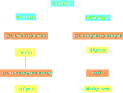
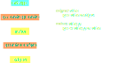
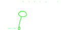

# Session 2

## Today

> - Project Enigma (part 1)
> - Makefile
> - Pointers and Memory

# Project Enigma

Encrypt and decrypt text


## Goals 

> - Encrypt and decrypt text
>     - simple cypher: alphabet shift
>     - "hello bob" -> "nkrru&huh" key=6
> - Dynamic library and command line
> - Functional tests (gtest)
> - Useable in python
>     - Crack the key with python ?

## let's prepare the project

- *Create a directory* **enigma**
- *Create a* **main.cpp** *with a **'int main()'** function*
- *Create a* **enigma.cpp** *and* **enigma.h**


## let's prepare the project

**enigma.cpp**

```{.cpp}
#include <iostream>

void encrypt(const char *src, char *dst) {
    std::cout << "Received " << src << std::endl;
}
```

**enigma.h**

```{.cpp}
void encrypt(const char *src, char *dst);
```

## Compilation ?



> - Do we have to run those commands every time there is a change ?

# 'make' it

## make and Makefile

- *make* is a build automation tool
- *make* looks for a file called *Makefile* 
- *Makefile* contains a set of rules
    - file to produce (target)
    - files needed
    - command to produce the target
- can be used for anything that needs to be built


## Makefile syntax

<div class="r-stack">

{.fragment .fade-in-then-out}

{.fragment}

</div>

```{.bash .fragment}
make
```

## Final makefile

```makefile
enigma: main.o enigma.o
	g++ main.o enigma.o -o enigma

main.o: main.cpp enigma.h
	g++ -c main.cpp -o main.o

enigma.o: enigma.cpp enigma.h
	g++ -c enigma.cpp -o enigma.o
```

> Notice the header is a dependency


# Memory and pointers 

## Pointer to String literal

```{.cpp .number-lines data-line-numbers="1-6|3" .fragment}
#include "enigma.h"
int main(int argc, const char **argv) {
    const char *phrase01 = "Hello world";
    encrypt(phrase01, nullptr); 
    return 0;
}
```

> - `phrase01` is a pointer (prefixed with a star) 
>     - *const* is a qualifier meaning the pointed object is constant, *char* is the type
> - a pointer is an address of something in the memory
>     - in that case a string literal compiled with the program


## Memory

<div class="r-stack">

{.fragment}

{.fragment}

{.fragment}

</div>

> - A pointer uses memory
> - It contains the address of the pointed object
> - The type is used to know the size of the pointed object

## Type sizes


<div class="r-stack">

```{.cpp .fragment .fade-in-then-out}
#include <iostream>
int main(int argc, const char **argv) {
    //const char *phrase01 = "Hello world";
    //encrypt(phrase01, nullptr); 
    std::cout << sizeof(int) << std::endl;
    std::cout << sizeof(long) << std::endl;
    return 0;
}
```

```{.cpp .fragment}
#include <iostream>
int main(int argc, const char **argv) {
    //const char *phrase01 = "Hello world";
    //encrypt(phrase01, nullptr); 
    std::cout << sizeof(int*) << std::endl;
    std::cout << sizeof(long*) << std::endl;
    return 0;
}
```
</div>

## Array of char

```{.cpp .fragment}
#include <iostream>
int main(int argc, const char **argv) {
    char phrase02[11]; // an array of 11 characters
    encrypt(phrase02, nullptr); 
    return 0;
}
```

> - phrase02 points to the beginning of the array
> - destroyed when leaving the scope 
> - size limited
> - array is not initialized
>    - undefined behavior


## Dereference and address of

```{.cpp .fragment}
#include <iostream>
int main(int argc, const char **argv) {
    char phrase03[11]; 
    
    phrase03[0] = 'h'; // single quote

    *(phrase03 + 1) = 'e'; // * means 'content of (address + 1) '

    char * substring = &(phrase03[3]); // & means address of

    encrypt(substring, nullptr); 
    return 0;
}
```

> - access to memory like python lists
> - \* means 'content of' (dereference)
> - \& means 'address of'

## Memory allocation 

```{.cpp .fragment}
#include <iostream>
int main(int argc, const char **argv) {
    char *phrase03 = new char[11]; // an array of 11 characters
    phrase03[0] = 'h';
    phrase03[10] = 0;
    encrypt(phrase03, nullptr); 
    return 0;
}
```

> - lifetime not limited to the current scope
> - you have to manage the memory 
> - size not limited (only by your system memory)


## Memory leak

```{.text data-line-numbers="10,14"}
valgrind ./enigma
==306== Memcheck, a memory error detector
==306== Copyright (C) 2002-2017, and GNU GPL'd, by Julian Seward et al.
==306== Using Valgrind-3.15.0 and LibVEX; rerun with -h for copyright info
==306== Command: ./enigma
==306==
hello bob
==306==
==306== HEAP SUMMARY:
==306==     in use at exit: 11 bytes in 1 blocks
==306==   total heap usage: 3 allocs, 2 frees, 73,768 bytes allocated
==306==
==306== LEAK SUMMARY:
==306==    definitely lost: 11 bytes in 1 blocks
==306==    indirectly lost: 0 bytes in 0 blocks
==306==      possibly lost: 0 bytes in 0 blocks
==306==    still reachable: 0 bytes in 0 blocks
==306==         suppressed: 0 bytes in 0 blocks
==306== Rerun with --leak-check=full to see details of leaked memory
==306==
==306== For lists of detected and suppressed errors, rerun with: -s
==306== ERROR SUMMARY: 0 errors from 0 contexts (suppressed: 0 from 0)
```

## Delete allocated memory

```{.cpp .fragment data-line-numbers="7"}
#include <iostream>
int main(int argc, const char **argv) {
    char *phrase03 = new char[11]; // an array of 11 characters
    phrase03[0] = 'h';
    phrase03[10] = 0;
    encrypt(phrase03, nullptr); 
    delete [] phrase03;
    return 0;
}
```

## nullptr

nullptr points to nothing

```{.cpp .fragment data-line-numbers="3,6"}
#include <iostream>
int main(int argc, const char **argv) {
    char *phrase03 = nullptr;
    phrase03[0] = 'h';
    phrase03[10] = 0;
    encrypt(phrase03, nullptr); 
    delete [] phrase03;
    return 0;
}
```

---
# OPTIONS FOR REVEAL.JS TEMPLATE
# see https://github.com/hakimel/reveal.js#configuration
reveal:
    # REQUIRED
    path: "./reveal.js"

    # RECOMMENDED
    # beige/black/blood/league/moon/night/serif/simple/sky/solarized/white
    theme: league
    # none/fade/slide/convex/concave/zoom
    transition: concave
    minified: false

    # OPTIONAL
    controls: true
    progress: true
    history: false
    keyboard: true
    overview: true
    center: false
    touch: true
    loop: false
    rtl: false
    fragments: true
    embedded: false
    help: true
    autoSlide: false
    autoSlideSpeed: '2000'
    autoSlideStoppable: true
    mouseWheel: false
    hideAddressBar: true
    previewLinks: false
    transitionSpeed: 'default' # default/fast/slow
    backgroundTransition: 'none' # none/fade/slide/convex/concave/zoom

---
