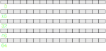
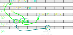
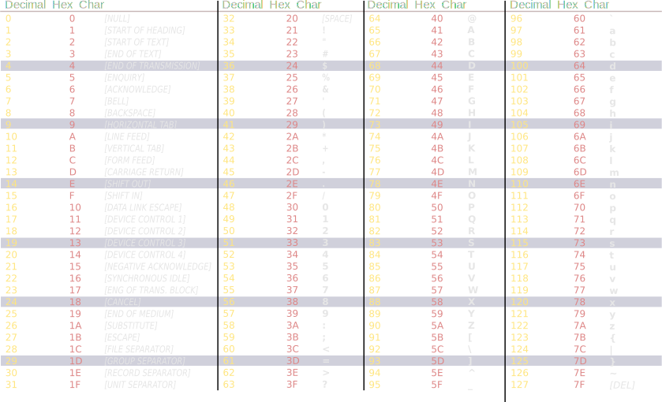

# Session 3

## Today

> - Implement enigma
> - Debug and profile

# Enigma implementation

## Last time

```{.cpp}
#include "enigma.h"
int main(int argc, const char **argv) {
    const char *word = nullptr; 
    const char *result = nullptr;
    encrypt(word, result); 
    return 0;
}

```

What we have to do:

> - Get the phrase to encrypt from the command line
> - Allocate memory for result
> - Implement the _encrypt_ cipher function
> - Print the result


## Pointers on pointers

Getting the phrase from the command line

```{.cpp .number-lines data-line-numbers="1-5|1" .fragment}
int main(int argc, const char **argv) {
    std::cout << argc << std::endl;
    std::cout << argv << std::endl;
}
```
> - *argc* is the number of parameter passed in the command line
> - *argv* is a pointer on pointer (const char \*\*argv)
>     - a pointer on an array of strings

## Pointers on pointers

<div class="r-stack">

{.fragment .fade-in-then-out}

{.fragment .fade-in-then-out}

{.fragment .fade-in-then-out}

{.fragment .fade-in}

</div>

```{.cpp .number-lines .fragment}
int main(int argc, const char **argv) {
    std::cout << argv << std::endl;
    std::cout << argv[0] << std::endl;
}
```

## Loops: for

```{.cpp}
for(initialisation; condition; update) {
  // do something
}
// Range based loop C++11
for (auto i: vec) {
}
```
> - *initialisation*: first time when the loop is entered 
> - *condition*: continue the loop if true
> - *update*: at the end of the loop

## For loop
Examples:
```{.cpp}
for(int i=0; i<20; i++) {
  // do something
}

for(int i=0, int j=10; i<20; i++, j--) {
  // do something
}
```
> - Your turn !
>    - in the main function 
>    - write code that iterates on the input arguments (use argc)
>    - note that argv[0] is the name of the program

## For loop

```{.cpp .number-lines .fragment}
int main(int argc, const char **argv) {
    for(int i=1; i<argc; i++) {
        std::cout << argv[i] << std::endl;
        // result ???
        encrypt(argv[i], result);
    }
}
```

> - We now want to allocate a buffer to put the result in
> - Size ?
>   - Same a argv[i]
> - Count the number of characters in argv[i]

## While loop
```{.cpp .number-lines .fragment}
while(condition) {
 // do something
}

do {
    // do something 
} while(condition)

```

> - iterate until condition becomes false


## While loop
```{.cpp .number-lines .fragment}
int main(int argc, const char **argv) {
    for(int i=1; i<argc; i++) {
        int nchar = 0; // number of characters
        while(/*insert code here*/) {
            /*insert code here*/
        };
        /*allocate result here*/
        encrypt(argv[i], result);
    }
}

```

> - Your turn ! count the characters
>    - the end of the string is 0 or '\\0'

## Allocating result
```{.cpp .number-lines .fragment}
int main(int argc, const char **argv) {
    for(int i=1; i<argc; i++) {
        int nchar = 0;
        while(argv[i][nchar] != '\0') nchar++;
        char result[nchar]; // can you spot the mistake ? 
        encrypt(argv[i], result);
    }
}
```

> - size of string buffer is nchar+1 accounting for '\0'


## Encrypt function

```{.cpp}

void encrypt(const char *src, char *result) {
    // assume src and result have the same size
    // iterate on the characters and apply a cipher function
}

```

> - alphabet shift function
>    - use ascii encoding


## Ascii



> - ascii: letter maps to a value


## Alphabet shift

char arithmetic

```{.cpp}

// char are values
char new_letter = 'a' + 3;
std::cout << new_letter << std::endl;

auto new_lettre = 'a' + 3; // new_lettre takes the type of 3 (int)
std::cout << new_lettre << std::endl;

```

> - char is a number (ascii) but is intepreted as letter
> - Can store values ranging from -128 to 127 (1 byte)
> - Overflow ?? yes ! try multiplying 2 char = 100

## Alphabet shift

Modulo Operator

```{.cpp}
// Modulo operator : %
std::cout << 10 % 3 << std::endl;

```

> - Modulo operator % 
>   - returns the remainder of a division, after one number is divided by another 
>   - useful to cycle on a range
> - Your turn, write a cipher function


## A possible encrypt function
```{.cpp}
void encrypt(const char *src, char *dst) {
    int key = 6;
    int index = 0;
    while (src[index] != '\0') {
        dst[index] = (((src[index]-'a') + key) % 26) + 'a';
        index++;
    };
}

```

> - An int in the function converts char to int
> - Can we get rid of index ?


## Using pointers to iterate 

```{.cpp}
void encrypt(const char *src, char *dst) {
    int key = 6;
    while (*src != '\0') {
        *dst = (((*src-'a') + key) % 26) + 'a';
        src++; dst++; 
    };
}

```
> - Pointers are also variables
> - Pointer arithmetic
>    - inc, dec, soustraction
>    - sizeof the pointed type


## Pointers to iterate 


## Print the result

```{.cpp .fragment .fade-in}
int main(int argc, const char **argv) {
    for(int i=1; i<argc; i++) {
        int nchar = 0;
        while(argv[i][nchar] != '\0') nchar++;
        char result[nchar]; // did you spot the mistake ? 
        encrypt(argv[i], result);
        std::cout << result << " ";
    }
    return 0;
}

```

## Running the program

```{.cpp}
./enigma hello world
```
> -  Seems good !

```{.cpp}
./enigma bonjoure world
```
> - Wait ... a bug ???


# Debug and profile

## Debugger and profilers
> - C++ allows memory errors, overflow, etc
> - Debuggers: gdb, lldb, visual studio c++
> - Profilers: perf, valgrind, vtune, ...

## Profiling enigma

> - Compile your code with symbols
>    - adds the function names and position in the machine code
>    - option '-g' in gcc = debug option

```{.bash}
valgrind enigma hello world
```

## Debugging enigma

Interactive Debugging Session

```{.bash}
gdb enigma
run hello world
```
> - breakpoint
> - running gdb
> - printing/displaying data
> - TUI


# Next time

> - Static Dynamic libraries
> - Call enigma functions from python
> - cmake basics, add gtest

> - TODO: prepare the decrypt function

---
# OPTIONS FOR REVEAL.JS TEMPLATE
# see https://github.com/hakimel/reveal.js#configuration
reveal:
    # REQUIRED
    path: "./reveal.js"

    # RECOMMENDED
    # beige/black/blood/league/moon/night/serif/simple/sky/solarized/white
    theme: league
    # none/fade/slide/convex/concave/zoom
    transition: concave
    minified: false

    # OPTIONAL
    controls: true
    progress: true
    history: false
    keyboard: true
    overview: true
    center: false
    touch: true
    loop: false
    rtl: false
    fragments: true
    embedded: false
    help: true
    autoSlide: false
    autoSlideSpeed: '2000'
    autoSlideStoppable: true
    mouseWheel: false
    hideAddressBar: true
    previewLinks: false
    transitionSpeed: 'default' # default/fast/slow
    backgroundTransition: 'none' # none/fade/slide/convex/concave/zoom

---
